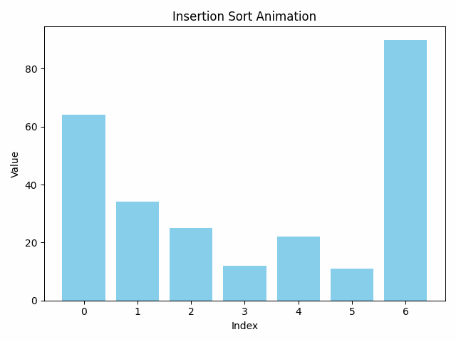

### The bubble sort

[Resource Link](https://www.toptal.com/developers/sorting-algorithms/bubble-sort): "Bubble sort has many of the same properties as insertion sort, but has slightly higher overhead. In the case of nearly sorted data, bubble sort takes O(n) time, but requires at least 2 passes through the data (whereas insertion sort requires something more like 1 pass)." as quoted from the source.

[bubble-sort](bubble-sort.c):  The source code.  

Outer Loop:
        This loop iterates through the array, narrowing down the unsorted portion. For each iteration i, the largest i elements will have reached their final sorted positions at the end of the array.

Inner Loop:
        For each pass, the inner loop compares adjacent elements, arr[j] and arr[j-1], from the end of the unsorted portion towards the beginning.
        If the current element (arr[j]) is smaller than the previous element (arr[j-1]), they are swapped.

Swapped Flag:
        A boolean flag swapped is introduced to track whether any swaps occur during the inner loop.
        If no swaps are performed, the array is already sorted, and the algorithm can terminate early by breaking out of the loop.

Invariant:
        After each outer loop iteration, the subarray arr[0..i] will be sorted and in its final position.

Early Termination:
        The swapped flag optimizes the algorithm by halting the process if the array becomes sorted before all outer loop iterations are completed.

Conclusion:

    Time Complexity:
        Best case (already sorted): O(n) (due to the early termination condition).
        Worst/average case: O(n²).
    Space Complexity: O(1) (in-place sorting).
    Stable Sort: Maintains the relative order of equal elements.

The explanation above highlights the process and efficiency considerations for implementing Bubble Sort.

---
### The insertion Sort
[Resource Link](https://www.toptal.com/developers/sorting-algorithms/insertion-sort): 
"Although it is one of the elementary sorting algorithms with O(n2) worst-case time, insertion sort is the algorithm of choice either when the data is nearly sorted (because it is adaptive) or when the problem size is small (because it has low overhead).

For these reasons, and because it is also stable, insertion sort is often used as the recursive base case (when the problem size is small) for higher overhead divide-and-conquer sorting algorithms, such as merge sort or quick sort." as quoted from the source.  

[insertion sort](./insertion-sort.c):  The source code.  
  

This C program implements the Insertion Sort algorithm:

- insertionSort: This function takes an array and its size, then sorts the array in-place using the insertion sort method. It iterates through the array starting from the second element, comparing it with the elements before it, moving larger elements one position ahead to insert the current element in its correct position.  
- printArray: A utility function to print the array contents.  
- main: Demonstrates how to use the insertion sort function by initializing an unsorted array, sorting it, and then printing both the unsorted and sorted arrays to show the effect of the sorting algorithm.  

This code follows the logic of insertion sort where you insert each element into its correct position in the sorted portion of the array.
