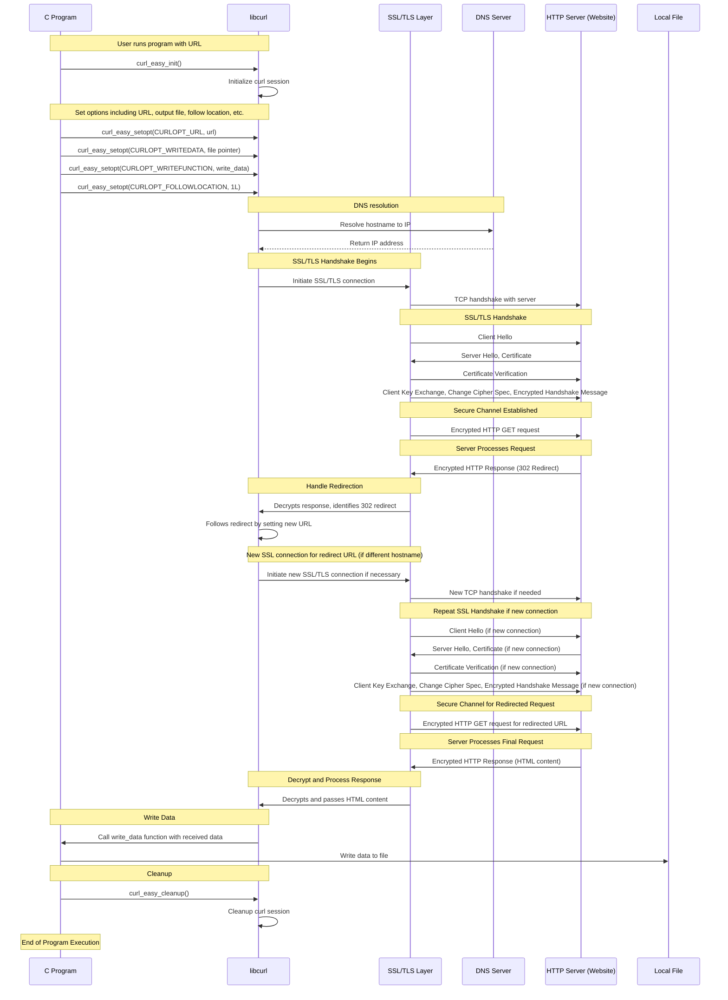

```mermaid
sequenceDiagram
    participant C as C Program
    participant Libcurl as libcurl
    participant SSL as SSL/TLS Layer
    participant DNS as DNS Server
    participant HTTP as HTTP Server (Website)
    
    Note over C,Libcurl: User runs program with URL
    C->>Libcurl: curl_easy_init()
    Libcurl->>Libcurl: Initialize curl session
    
    Note over C,Libcurl: Set options including URL, output file, follow location, etc.
    C->>Libcurl: curl_easy_setopt(CURLOPT_URL, url)
    C->>Libcurl: curl_easy_setopt(CURLOPT_WRITEDATA, file pointer)
    C->>Libcurl: curl_easy_setopt(CURLOPT_WRITEFUNCTION, write_data)
    C->>Libcurl: curl_easy_setopt(CURLOPT_FOLLOWLOCATION, 1L)
    
    Note over Libcurl,DNS: DNS resolution
    Libcurl->>DNS: Resolve hostname to IP
    DNS-->>Libcurl: Return IP address
    
    Note over Libcurl,SSL: SSL/TLS Handshake Begins
    Libcurl->>SSL: Initiate SSL/TLS connection
    SSL->>HTTP: TCP handshake with server
    
    Note over SSL,HTTP: SSL/TLS Handshake
    SSL->>HTTP: Client Hello
    HTTP->>SSL: Server Hello, Certificate
    SSL->>HTTP: Certificate Verification
    SSL->>HTTP: Client Key Exchange, Change Cipher Spec, Encrypted Handshake Message
    
    Note over SSL,HTTP: Secure Channel Established
    SSL->>HTTP: Encrypted HTTP GET request
    
    Note over HTTP,SSL: Server Processes Request
    HTTP->>SSL: Encrypted HTTP Response (302 Redirect)
    
    Note over SSL,Libcurl: Handle Redirection
    SSL->>Libcurl: Decrypts response, identifies 302 redirect
    Libcurl->>Libcurl: Follows redirect by setting new URL
    
    Note over Libcurl,SSL: New SSL connection for redirect URL (if different hostname)
    Libcurl->>SSL: Initiate new SSL/TLS connection if necessary
    SSL->>HTTP: New TCP handshake if needed
    
    Note over SSL,HTTP: Repeat SSL Handshake if new connection
    SSL->>HTTP: Client Hello (if new connection)
    HTTP->>SSL: Server Hello, Certificate (if new connection)
    SSL->>HTTP: Certificate Verification (if new connection)
    SSL->>HTTP: Client Key Exchange, Change Cipher Spec, Encrypted Handshake Message (if new connection)
    
    Note over SSL,HTTP: Secure Channel for Redirected Request
    SSL->>HTTP: Encrypted HTTP GET request for redirected URL
    
    Note over HTTP,SSL: Server Processes Final Request
    HTTP->>SSL: Encrypted HTTP Response (HTML content)
    
    Note over SSL,Libcurl: Decrypt and Process Response
    SSL->>Libcurl: Decrypts and passes HTML content
    
    Note over Libcurl,C: Write Data
    Libcurl->>C: Call write_data function with received data
    C->>Local File: Write data to file
    
    Note over C,Libcurl: Cleanup
    C->>Libcurl: curl_easy_cleanup()
    Libcurl->>Libcurl: Cleanup curl session
    
    Note over C: End of Program Execution
```