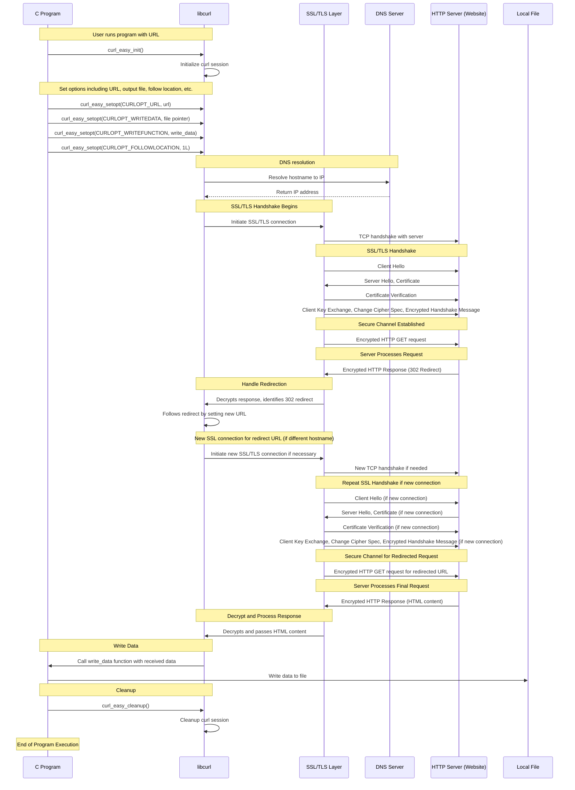

# Simple CURL Downloader

This is a basic implementation of a command-line tool that downloads web content using `libcurl` and saves it to a file. The filename is derived from the URL provided, ensuring a unique name for each download.

## Features

- **Download Web Pages:** Fetches content from a given URL.
- **File Naming:** Automatically generates a filename based on the URL, replacing slashes with hyphens and appending `.html` if needed.
- **User-Agent:** Sets a custom User-Agent string to mimic a common browser.
- **Follow Redirects:** Automatically follows URL redirections.

## Prerequisites

- **libcurl:** You need to have `libcurl` installed on your system to compile and run this program. For most Linux distributions, you can install it using your package manager:
  - Ubuntu/Debian: `sudo apt-get install libcurl4-openssl-dev`
  - Fedora: `sudo dnf install libcurl-devel`

## Usage

To use this program, compile it and then run it with a URL as an argument:

```sh
gcc -o curl_downloader curl_downloader.c -lcurl
./curl_downloader <URL>
```

Example
```sh
./curl_downloader https://example.com/some/path
```

This will download the content from https://example.com/some/path and save it as example.com-some-path.html.

Code Structure

    write_data: Callback function for writing downloaded data to a file.
    get_filename_from_url: Function to generate a filename from the URL, ensuring no conflicts by replacing slashes with hyphens and ensuring the file has an .html extension.
    main: Handles command-line arguments, initializes libcurl, performs the download, and writes the data to a file.


Limitations

    URL Length: There's a predefined maximum length for URLs and filenames to prevent buffer overflows.
    File Type: It assumes or forces an .html file extension, which might not be suitable for all content types.
    Error Handling: Basic error reporting is implemented, but more extensive error checks could be added for robustness.


Future Enhancements

    Implement more curl options like verbose output, authentication, or custom headers.
    Enhance the filename generation to handle different file types or MIME types detected in headers.
    Add command-line options for users to specify output filenames, directories, or different behaviors.


License
This code is provided under the MIT License (LICENSE).

Feel free to contribute by suggesting improvements or adding features through pull requests or issues!

### Sequence Diagram
The libcurl implementation is very simple but highly customized to my needs.

